 

<table>
<tr>
<td valign="top"></td>
<td valign="top"></td>
</tr>
</table>

 

I build secure, scalable backend systems — REST &amp; gRPC services, event-driven pipelines with **Kafka** and **Redis**, and full-stack apps with **Angular**, **React**, **SpringBoot**, **FastAPI**. I'm deep in **Agentic AI, RAG, and LLMs** — figuring out how to make systems not just fast and secure, but genuinely intelligent.

 

 

 

<!-- contributor heatmap last -->

